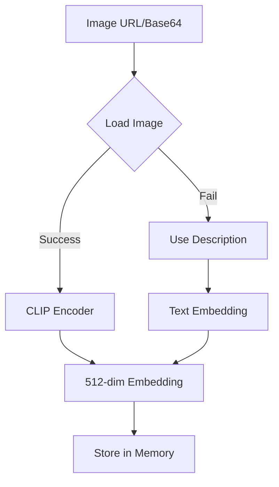

# 🎨 Multi-Modal Guide

## Overview

The Embed Service now supports **multi-modal inputs** across both Phase A (Hypothesizer) and Phase B (Executor). You can now provide text, images, audio, and video inputs, and the system will:

1. Generate context-aware hypotheses based on the media type
2. Create multi-modal embeddings using CLIP, sentence-transformers, or fallback mechanisms
3. Enrich prompts with multi-modal context
4. Store and retrieve multi-modal memories

## 🚀 Supported Media Types

| Media Type | Support Level | Embedding Model | Status |
|------------|--------------|-----------------|---------|
| **Text** | ✅ Full | sentence-transformers / CLIP | Production Ready |
| **Image** | ✅ Full | CLIP (ViT-B/32) | Production Ready |
| **Audio** | ⚠️ Partial | Description-based fallback | Ready (extensible with CLAP) |
| **Video** | ⚠️ Partial | Description-based fallback | Ready (extensible with VideoCLIP) |

## 📦 Installation

### Basic (Text-Only)
```bash
pip install -e .
```

### With Multi-Modal Support
```bash
# Install all multi-modal dependencies
pip install -e ".[multimodal]"

# Or install everything (dev + multimodal)
pip install -e ".[all]"
```

**Multi-modal dependencies include:**
- `transformers` - Hugging Face models (CLIP)
- `torch` - PyTorch for model inference
- `sentence-transformers` - Text embeddings
- `pillow` - Image processing
- `requests` - For loading images from URLs

## 🔧 Configuration

No special configuration needed! The service automatically:
- Falls back to hash-based embeddings if models aren't available
- Lazy-loads models only when needed
- Handles offline/online scenarios gracefully

## 📝 API Usage

### Phase A - Hypothesize with Multi-Modal Input

#### Text Input (Original)
```bash
curl -X POST http://localhost:8000/v1/hypothesize \
  -H "Content-Type: application/json" \
  -d '{
    "user_id": "alice",
    "input_text": "build an API"
  }'
```

#### Image Input (URL)
```bash
curl -X POST http://localhost:8000/v1/hypothesize \
  -H "Content-Type: application/json" \
  -d '{
    "user_id": "alice",
    "media_type": "image",
    "media_url": "https://example.com/diagram.jpg",
    "input_text": "What does this architecture diagram show?"
  }'
```

**Response:**
```json
{
  "hypotheses": [
    {
      "id": "h1",
      "question": "Do you want me to analyze and describe what's in this image?",
      "rationale": "Image analysis request",
      "confidence": 0.80
    },
    {
      "id": "h2",
      "question": "Do you want to extract text or specific information from this image?",
      "rationale": "OCR or information extraction",
      "confidence": 0.72
    },
    {
      "id": "h3",
      "question": "Do you want me to answer questions about this image?",
      "rationale": "Visual question answering",
      "confidence": 0.68
    }
  ],
  "auto_advance": false
}
```

#### Image Input (Base64)
```bash
curl -X POST http://localhost:8000/v1/hypothesize \
  -H "Content-Type: application/json" \
  -d '{
    "user_id": "alice",
    "media_type": "image",
    "media_base64": "data:image/png;base64,iVBORw0KGgoAAAANSUhEUgAA...",
    "input_text": "Analyze this screenshot"
  }'
```

#### Audio Input
```bash
curl -X POST http://localhost:8000/v1/hypothesize \
  -H "Content-Type: application/json" \
  -d '{
    "user_id": "alice",
    "media_type": "audio",
    "media_url": "https://example.com/meeting.mp3",
    "input_text": "Summarize this meeting recording"
  }'
```

**Response:**
```json
{
  "hypotheses": [
    {
      "id": "h1",
      "question": "Do you want me to transcribe this audio content?",
      "rationale": "Speech-to-text transcription",
      "confidence": 0.82
    },
    {
      "id": "h2",
      "question": "Do you want me to summarize what was said in this audio?",
      "rationale": "Audio summary request",
      "confidence": 0.75
    }
  ]
}
```

#### Video Input
```bash
curl -X POST http://localhost:8000/v1/hypothesize \
  -H "Content-Type: application/json" \
  -d '{
    "user_id": "alice",
    "media_type": "video",
    "media_url": "https://example.com/tutorial.mp4",
    "input_text": "Extract key moments from this tutorial"
  }'
```

### Phase B - Execute with Multi-Modal Input

```bash
curl -X POST http://localhost:8000/v1/execute \
  -H "Content-Type: application/json" \
  -d '{
    "user_id": "alice",
    "media_type": "image",
    "media_url": "https://example.com/diagram.jpg",
    "input_text": "What does this show?",
    "hypothesis_id": "h1"
  }'
```

**Response:**
```json
{
  "enriched_prompt": "SYSTEM\nYou are executing a task for alice...\n\n[Image analysis context included]\n...",
  "tokens_estimate": 1456,
  "context_breakdown": {
    "goal_summary": 120,
    "preferences_style": 180,
    "critical_artifacts": 450,
    "recent_history": 280,
    "constraints": 140,
    "task_specific_retrieval": 126,
    "safety_system": 60
  }
}
```

## 🎯 Multi-Modal Features

### 1. **Automatic Embedding Generation**

The system automatically selects the best embedding method:

```python
# For TEXT
- Tries: sentence-transformers → CLIP text encoder → hash fallback

# For IMAGES  
- Tries: CLIP image encoder → description fallback → hash fallback

# For AUDIO
- Uses: description → text embedding (extensible with CLAP)

# For VIDEO
- Uses: description → text embedding (extensible with VideoCLIP)
```

### 2. **Lazy Model Loading**

Models are loaded only when needed:
- First text embedding → loads sentence-transformers
- First image embedding → loads CLIP
- Models are cached for subsequent requests

### 3. **Graceful Degradation**

```python
# If transformers not installed
→ Falls back to hash-based embeddings

# If image can't be loaded
→ Uses text description as fallback

# If network fails
→ Uses local fallback mechanisms
```

### 4. **Memory Storage**

Multi-modal memories are stored with:
- `content` - Text description
- `media_type` - Type of media (text/image/audio/video)
- `media_url` - URL to the media file
- `media_description` - Text description of media
- `embedding` - Multi-modal embedding vector
- `tags` - Includes media type tag

## 🔍 How It Works

### Image Processing Flow



### Hypothesis Generation

```python
# Text Input
"build an API" → Pattern matching → REST API hypotheses

# Image Input  
[diagram.jpg] → Image analysis hypotheses → OCR, description, QA

# Audio Input
[meeting.mp3] → Audio hypotheses → Transcribe, summarize, analyze

# Video Input
[tutorial.mp4] → Video hypotheses → Summarize, extract frames, transcribe
```

## 📊 Examples

### Example 1: Analyze Screenshot

```python
import requests

response = requests.post('http://localhost:8000/v1/hypothesize', json={
    'user_id': 'developer_1',
    'media_type': 'image',
    'media_url': 'https://i.imgur.com/error_screenshot.png',
    'input_text': 'Help me debug this error'
})

hypotheses = response.json()['hypotheses']
# Returns: 
# - "Do you want me to extract text from this error message?"
# - "Do you want help debugging this specific error?"
# - "Do you want me to explain what's causing this error?"
```

### Example 2: Transcribe Meeting

```python
response = requests.post('http://localhost:8000/v1/hypothesize', json={
    'user_id': 'manager_1',
    'media_type': 'audio',
    'media_url': 'https://example.com/team_standup.mp3',
    'input_text': 'Get action items from this standup'
})
```

### Example 3: Video Tutorial Summary

```python
response = requests.post('http://localhost:8000/v1/execute', json={
    'user_id': 'student_1',
    'media_type': 'video',
    'media_url': 'https://youtube.com/watch?v=tutorial_id',
    'input_text': 'Create study notes from this lecture',
    'hypothesis_id': 'h1'
})
```

## 🛠️ Extending Multi-Modal Support

### Adding CLAP for Audio

```python
# In app/utils/embeddings.py

from transformers import ClapModel, ClapProcessor

def generate_audio_embedding(audio_url, audio_base64, description):
    # Load CLAP model
    model = ClapModel.from_pretrained("laion/clap-htsat-unfused")
    processor = ClapProcessor.from_pretrained("laion/clap-htsat-unfused")
    
    # Load audio file
    audio = load_audio(audio_url or audio_base64)
    
    # Generate embedding
    inputs = processor(audios=audio, return_tensors="pt")
    audio_features = model.get_audio_features(**inputs)
    
    return audio_features[0].tolist()
```

### Adding VideoCLIP for Video

```python
# In app/utils/embeddings.py

def generate_video_embedding(video_url, video_base64, description):
    # Extract key frames from video
    frames = extract_frames(video_url, num_frames=8)
    
    # Use CLIP on each frame
    frame_embeddings = [generate_image_embedding(frame) for frame in frames]
    
    # Average frame embeddings
    video_embedding = np.mean(frame_embeddings, axis=0)
    
    return video_embedding.tolist()
```

## 🧪 Testing Multi-Modal Features

```bash
# Test with sample image
curl -X POST http://localhost:8000/v1/hypothesize \
  -H "Content-Type: application/json" \
  -d '{
    "user_id": "test",
    "media_type": "image",
    "media_url": "https://picsum.photos/200/300"
  }'

# Test with base64 image
python3 << 'EOF'
import base64
import requests

with open("test_image.jpg", "rb") as f:
    img_b64 = base64.b64encode(f.read()).decode()

response = requests.post('http://localhost:8000/v1/hypothesize', json={
    'user_id': 'test',
    'media_type': 'image',
    'media_base64': f'data:image/jpeg;base64,{img_b64}',
    'input_text': 'Describe this image'
})

print(response.json())
EOF
```

## 📈 Performance Considerations

### Model Loading Times (First Use)

- **sentence-transformers**: ~2-3 seconds
- **CLIP**: ~5-7 seconds
- **Total memory**: ~500MB-1GB

### Embedding Generation Times

- **Text**: 10-50ms (sentence-transformers)
- **Image**: 50-150ms (CLIP)
- **Fallback (hash)**: <1ms

### Optimization Tips

1. **Pre-load models** at startup for production
2. **Use GPU** if available (set `CUDA_VISIBLE_DEVICES`)
3. **Cache embeddings** for frequently accessed media
4. **Use CDN** for media URLs to reduce loading time

## 🔐 Security & Privacy

- **No media storage**: Media files are not stored, only URLs/descriptions
- **PII redaction**: Applies to all text descriptions
- **Safe loading**: Images validated before processing
- **Size limits**: Add request size limits in production

## 🚨 Troubleshooting

### Models not loading

```bash
# Check if transformers installed
pip show transformers torch pillow

# Install if missing
pip install transformers torch pillow
```

### Out of memory errors

```python
# Use smaller models or CPU-only mode
# In .env:
TORCH_DEVICE=cpu
```

### Image loading fails

```python
# Check URL accessibility
curl -I https://your-image-url.jpg

# Try base64 instead of URL
```

## 📚 API Reference

### Request Fields

| Field | Type | Required | Description |
|-------|------|----------|-------------|
| `user_id` | string | ✅ Yes | User identifier |
| `input_text` | string | ⚠️ Optional* | Text input or description |
| `media_type` | enum | No | "text", "image", "audio", "video" (default: "text") |
| `media_url` | string | ⚠️ Optional* | URL to media file |
| `media_base64` | string | ⚠️ Optional* | Base64 encoded media |

\* At least one of `input_text`, `media_url`, or `media_base64` must be provided.

### Response Fields

Same as before, with added support for multi-modal context in enriched prompts.

## 🎉 Next Steps

1. **Try the examples** above with your own media
2. **Install multi-modal dependencies**: `pip install -e ".[multimodal]"`
3. **Extend with CLAP/VideoCLIP** for advanced audio/video support
4. **Build multi-modal applications** on top of this API

---

**Questions?** Check the main README.md or open an issue!

